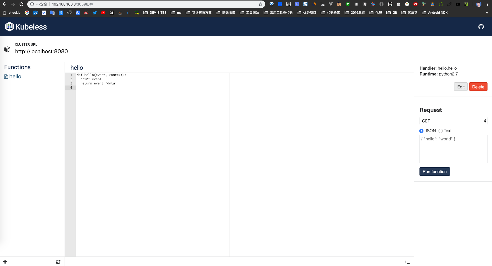

https://github.com/kubeless/kubeless-ui

#### 安装

To run the UI inside your Kubernetes cluster as a Deployment and Service you can run the following:

```
kubectl create -f https://raw.githubusercontent.com/kubeless/kubeless-ui/master/k8s.yaml
```

Kubeless UI 的部署创建了一个 NodePort 的 Service。通过访问节点的 IP 加上 NodePort 的端口就可以从 Kubernetes 集群外的主机访问这个控制台

命令执行记录：

```
[root@dockerapp ~]# kubectl create -f https://raw.githubusercontent.com/kubeless/kubeless-ui/master/k8s.yaml
serviceaccount/ui-acct created
clusterrole.rbac.authorization.k8s.io/kubeless-ui created
clusterrolebinding.rbac.authorization.k8s.io/kubeless-ui created
deployment.extensions/ui created
service/ui created

[root@dockerapp ~]# kubectl get deployments -n kubeless
NAME                          READY   UP-TO-DATE   AVAILABLE   AGE
kubeless-controller-manager   1/1     1            1           73m
ui                            1/1     1            1           2m10s

[root@dockerapp ~]# kubectl get services -n kubeless
NAME   TYPE       CLUSTER-IP       EXTERNAL-IP   PORT(S)          AGE
ui     NodePort   10.101.167.103   <none>        3000:30598/TCP   2m23s

[root@dockerapp ~]# kubectl get replicasets -n kubeless
NAME                                     DESIRED   CURRENT   READY   AGE
kubeless-controller-manager-7c7bcb8db4   1         1         1       11h
ui-59dbf498c                             1         1         1       10h

[root@dockerapp ~]# kubectl get pods -n kubeless
NAME                                           READY   STATUS    RESTARTS   AGE
kubeless-controller-manager-7c7bcb8db4-fw7mq   3/3     Running   0          74m
ui-59dbf498c-7gzct                             2/2     Running   0          2m30s
[root@dockerapp ~]#
```

通过 `kubectl get services -n kubeless` 命令查询到 ui 的端口为 30598，通过 ip:port 即可访问：



---

```
[root@dockerapp ~]# kubectl describe deployment ui -n kubeless
Name:                   ui
Namespace:              kubeless
CreationTimestamp:      Wed, 23 Jan 2019 23:32:26 +0800
Labels:                 controller=ui
Annotations:            deployment.kubernetes.io/revision: 1
Selector:               controller=ui
Replicas:               1 desired | 1 updated | 1 total | 1 available | 0 unavailable
StrategyType:           RollingUpdate
MinReadySeconds:        0
RollingUpdateStrategy:  1 max unavailable, 1 max surge
Pod Template:
  Labels:           controller=ui
  Service Account:  ui-acct
  Containers:
   ui:
    Image:        bitnami/kubeless-ui:latest
    Port:         3000/TCP
    Host Port:    0/TCP
    Environment:  <none>
    Mounts:       <none>
   proxy:
    Image:      lachlanevenson/k8s-kubectl:v1.13.1
    Port:       <none>
    Host Port:  <none>
    Args:
      proxy
      -p
      8080
    Environment:  <none>
    Mounts:       <none>
  Volumes:        <none>
Conditions:
  Type           Status  Reason
  ----           ------  ------
  Available      True    MinimumReplicasAvailable
OldReplicaSets:  <none>
NewReplicaSet:   ui-59dbf498c (1/1 replicas created)
Events:
  Type    Reason             Age    From                   Message
  ----    ------             ----   ----                   -------
  Normal  ScalingReplicaSet  3m20s  deployment-controller  Scaled up replica set ui-59dbf498c to 1
[root@dockerapp ~]#
```

```
[root@dockerapp ~]# kubectl describe service ui -n kubeless
Name:                     ui
Namespace:                kubeless
Labels:                   controller=ui
Annotations:              <none>
Selector:                 controller=ui
Type:                     NodePort
IP:                       10.101.167.103
Port:                     ui-port  3000/TCP
TargetPort:               3000/TCP
NodePort:                 ui-port  30598/TCP
Endpoints:                10.244.1.10:3000
Session Affinity:         None
External Traffic Policy:  Cluster
Events:                   <none>
[root@dockerapp ~]#
```

```
[root@dockerapp ~]# kubectl describe replicaset ui-59dbf498c -n kubeless
Name:           ui-59dbf498c
Namespace:      kubeless
Selector:       controller=ui,pod-template-hash=59dbf498c
Labels:         controller=ui
                pod-template-hash=59dbf498c
Annotations:    deployment.kubernetes.io/desired-replicas: 1
                deployment.kubernetes.io/max-replicas: 2
                deployment.kubernetes.io/revision: 1
Controlled By:  Deployment/ui
Replicas:       1 current / 1 desired
Pods Status:    1 Running / 0 Waiting / 0 Succeeded / 0 Failed
Pod Template:
  Labels:           controller=ui
                    pod-template-hash=59dbf498c
  Service Account:  ui-acct
  Containers:
   ui:
    Image:        bitnami/kubeless-ui:latest
    Port:         3000/TCP
    Host Port:    0/TCP
    Environment:  <none>
    Mounts:       <none>
   proxy:
    Image:      lachlanevenson/k8s-kubectl:v1.13.1
    Port:       <none>
    Host Port:  <none>
    Args:
      proxy
      -p
      8080
    Environment:  <none>
    Mounts:       <none>
  Volumes:        <none>
Events:           <none>
```

```
[root@dockerapp ~]# kubectl describe pod ui-59dbf498c-7gzct -n kubeless
Name:               ui-59dbf498c-7gzct
Namespace:          kubeless
Priority:           0
PriorityClassName:  <none>
Node:               qgw-live/192.168.160.5
Start Time:         Wed, 23 Jan 2019 23:32:26 +0800
Labels:             controller=ui
                    pod-template-hash=59dbf498c
Annotations:        <none>
Status:             Running
IP:                 10.244.1.10
Controlled By:      ReplicaSet/ui-59dbf498c
Containers:
  ui:
    Container ID:   docker://03d13d37ee40e53856486ebdf4b6cba6c0c72cc80825a90d5f16f163f2e5dc9e
    Image:          bitnami/kubeless-ui:latest
    Image ID:       docker-pullable://bitnami/kubeless-ui@sha256:e94bce1df20a15f517c4ef753acc90dbd3ee5e658faf4b8d703d17817b4da390
    Port:           3000/TCP
    Host Port:      0/TCP
    State:          Running
      Started:      Wed, 23 Jan 2019 23:32:59 +0800
    Ready:          True
    Restart Count:  0
    Environment:    <none>
    Mounts:
      /var/run/secrets/kubernetes.io/serviceaccount from ui-acct-token-cggq8 (ro)
  proxy:
    Container ID:  docker://22dae0560ab7051f1b4d67ef485250c176c2080e487276ae4a921c956724647a
    Image:         lachlanevenson/k8s-kubectl:v1.13.1
    Image ID:      docker-pullable://lachlanevenson/k8s-kubectl@sha256:02ca7f1a0f0410a6de924c08284ceae4102b206d801522bf51d505959174021d
    Port:          <none>
    Host Port:     <none>
    Args:
      proxy
      -p
      8080
    State:          Running
      Started:      Wed, 23 Jan 2019 23:33:16 +0800
    Ready:          True
    Restart Count:  0
    Environment:    <none>
    Mounts:
      /var/run/secrets/kubernetes.io/serviceaccount from ui-acct-token-cggq8 (ro)
Conditions:
  Type              Status
  Initialized       True
  Ready             True
  ContainersReady   True
  PodScheduled      True
Volumes:
  ui-acct-token-cggq8:
    Type:        Secret (a volume populated by a Secret)
    SecretName:  ui-acct-token-cggq8
    Optional:    false
QoS Class:       BestEffort
Node-Selectors:  <none>
Tolerations:     node.kubernetes.io/not-ready:NoExecute for 300s
                 node.kubernetes.io/unreachable:NoExecute for 300s
Events:          <none>
[root@dockerapp ~]#
```